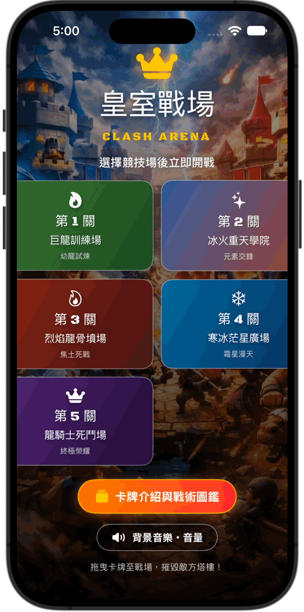
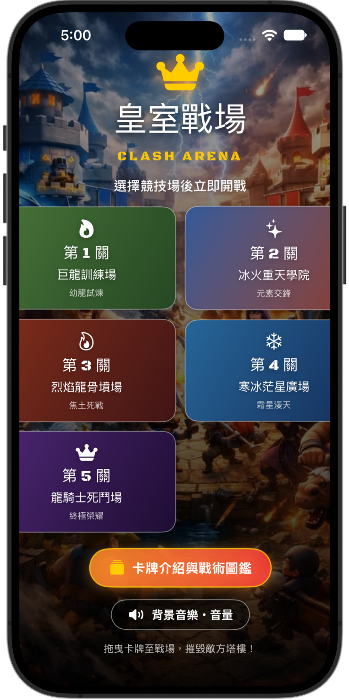
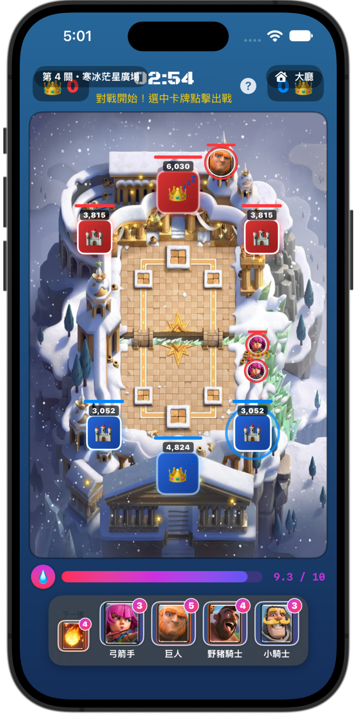
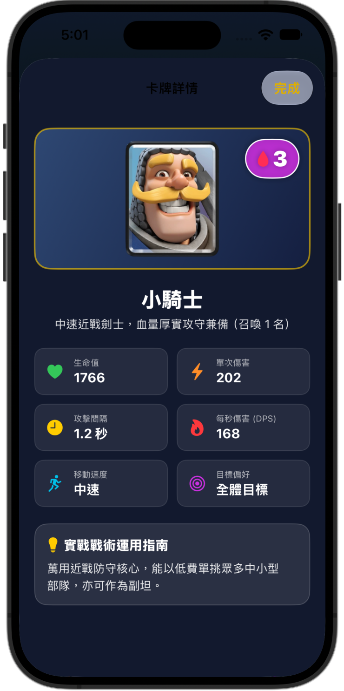

# ⚔️ Clash Arena · 皇家戰場

  <strong>An original iOS arena card-battle game built with SwiftUI.</strong>

  
  
  
  

  <a href="#english">🇺🇸 English</a> &nbsp;•&nbsp; <a href="#中文">🇹🇼 中文</a>

---

## 🇺🇸 English

### 🎮 Overview

**Clash Arena** is a fast-paced, single-player card-battle prototype for iOS. Choose one of five unique arenas, deploy troops and spells, manage elixir, and destroy the enemy's towers before the battle ends.

### ✨ Features

- 🏟️ **Five themed arenas** with progressively stronger AI opponents.
- 🃏 **Eight core cards** — ground troops, flying units, building-targeting attackers, and area spells.
- ⚡ **Dynamic elixir** — 2× elixir from 2:00 remaining, then 3× elixir in the final minute.
- 👑 **Tower victory system** — defeat the enemy king tower for an instant three-crown victory; otherwise win by tower count or survive overtime.
- 🔥 **Sudden-death overtime** — tied matches drain every tower's health with visible damage numbers until a winner emerges.
- 📚 **Card encyclopedia** with filters, detailed statistics, and tactical guidance.
- 🔊 **Background music controls** and a custom tactical display font.

### 🎥 Gameplay Flow

  

### 📱 Screenshots

  
  
  

### 🧩 Built With

| Technology | Purpose |
|---|---|
| SwiftUI | Responsive game interface and presentation |
| Swift + Combine | Game loop and observable game state |
| AVFoundation | Looping background music |
| CoreText | Tactical-style custom font registration |

### 🚀 Run the Project

1. Open `IOS-HW.xcodeproj` in Xcode.
2. Choose an iPhone simulator or a physical device.
3. Press <kbd>⌘R</kbd> to build and run.
4. Select an arena and begin the battle! ⚔️

[⬆ Back to top](#top)

---

## 🇹🇼 中文

### 🎮 專案介紹

**皇家戰場**是一款使用 SwiftUI 製作的原創 iOS 單人卡牌對戰遊戲。選擇五個主題競技場之一，部署部隊與法術、管理聖水，並在戰鬥結束前摧毀敵方防禦塔！

### ✨ 遊戲特色

- 🏟️ **五個主題競技場**：每關都有不同背景與逐步增強的 AI。
- 🃏 **八張核心卡牌**：地面部隊、飛行單位、攻城單位與範圍法術一應俱全。
- ⚡ **動態聖水機制**：倒數兩分鐘啟動雙倍聖水；最後一分鐘切換為三倍聖水。
- 👑 **防禦塔勝負系統**：擊毀敵方國王主塔立即獲得三皇冠勝利；否則比較剩餘塔數或進入加時。
- 🔥 **加時決勝**：平手時所有塔會持續扣血，並顯示可見傷害數字直到分出勝負。
- 📚 **卡牌圖鑑**：支援篩選、查看完整屬性與實戰戰術說明。
- 🔊 **背景音樂控制**與戰術風格自訂字體。

### 🎥 操作流程 GIF

  

### 📱 App 截圖

  
  
  

### 🧩 使用技術

| 技術 | 用途 |
|---|---|
| SwiftUI | 建立回應式遊戲介面與畫面呈現 |
| Swift + Combine | 處理遊戲迴圈與可觀察狀態 |
| AVFoundation | 循環播放背景音樂 |
| CoreText | 註冊戰術風格自訂字體 |

### 🚀 執行方式

1. 使用 Xcode 開啟 `IOS-HW.xcodeproj`。
2. 選擇 iPhone 模擬器或實體裝置。
3. 按下 <kbd>⌘R</kbd> 建置並執行。
4. 選擇競技場，立即開戰！⚔️

[⬆ 回到頂端](#top)
