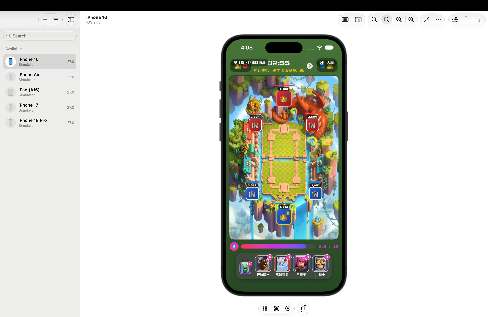
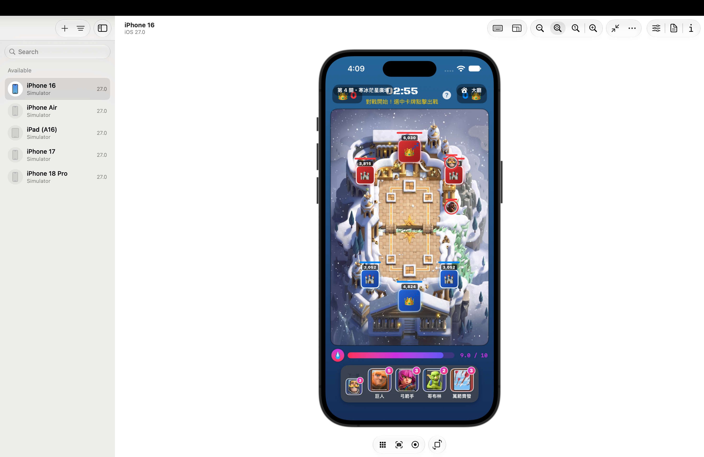
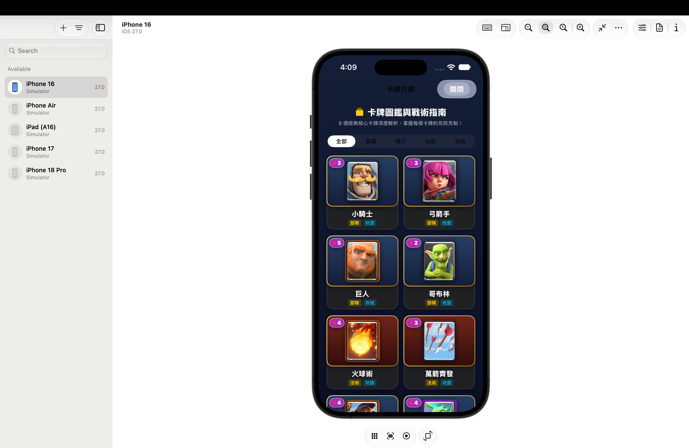

# ⚔️ Clash Arena — 皇家戰場

  <strong>A fast-paced, single-player arena card battle built with SwiftUI.</strong>

  
  
  
  

  <a href="#english">🇺🇸 English</a> · <a href="#中文">🇹🇼 中文</a>

---

## 🇺🇸 English

### 🎮 Overview

**Clash Arena** is an original iOS card-battle game prototype. Pick one of five themed arenas, deploy units and spells, manage elixir, cross bridges, and destroy the opposing towers before time runs out.

### ✨ Highlights

- 🏟️ **Five themed arenas** with progressively stronger AI opponents.
- 🃏 **Eight playable cards**: troops, building-focused attackers, flying units, and spells.
- ⚡ **Elixir escalation**: 2× elixir at two minutes remaining and 3× elixir in the final minute.
- 🏰 **Tower combat rules**: win by destroying all three opposing towers; tied tower counts trigger an animated overtime tower-drain showdown.
- 📚 **Card guide** with a filterable catalogue, detailed statistics, and tactical tips.
- 🔊 **Background music and volume controls**.

### 📱 Screenshots

  
  
  

  
  

### 🎥 Gameplay Video

> ℹ️ The full gameplay recording is kept locally because it exceeds GitHub's 100 MB file-size limit.

### 🧩 Built With

- **SwiftUI** for the interface and game presentation.
- **Swift / Combine** for the game loop and observable state.
- **AVFoundation** for looping background music.
- **Black Ops One** for tactical-style display text (SIL Open Font License).

### 🚀 Run Locally

1. Open `IOS-HW.xcodeproj` in Xcode.
2. Select an iOS simulator or a physical device.
3. Build and run with <kbd>⌘R</kbd>.
4. Choose an arena and start the battle! ⚔️

[⬆ Back to top](#top)

---

## 🇹🇼 中文

### 🎮 專案介紹

**皇家戰場**是一款原創的 iOS 單人卡牌對戰遊戲原型。玩家可從五個不同主題的競技場中選關，部署部隊與法術、累積聖水、穿越橋樑，並在時間結束前摧毀敵方防禦塔。

### ✨ 特色

- 🏟️ **五個競技場主題**：每關擁有不同背景，AI 會隨關卡逐步增強。
- 🃏 **八張可用卡牌**：包含地面部隊、攻城單位、飛行部隊與範圍法術。
- ⚡ **聖水節奏升級**：倒數兩分鐘進入雙倍聖水，最後一分鐘進入三倍聖水。
- 🏰 **防禦塔勝負規則**：摧毀敵方三座塔直接獲勝；塔數平手時，進入可見血量持續下降的加時決勝。
- 📚 **卡牌圖鑑**：可篩選、查看卡牌屬性與實戰戰術提示。
- 🔊 **背景音樂與音量設定**。

### 📱 App 截圖

  
  
  

  
  

### 🎥 操作錄影

> ℹ️ 完整操作錄影因超過 GitHub 單檔 100 MB 限制，僅保留在本機。

### 🧩 技術使用

- **SwiftUI**：建立介面與遊戲畫面。
- **Swift / Combine**：處理遊戲迴圈與可觀察狀態。
- **AVFoundation**：播放循環背景音樂。
- **Black Ops One**：提供戰術感的顯示字體（SIL Open Font License）。

### 🚀 如何執行

1. 使用 Xcode 開啟 `IOS-HW.xcodeproj`。
2. 選擇 iOS 模擬器或實體裝置。
3. 按下 <kbd>⌘R</kbd> 建置並執行。
4. 選擇競技場，立刻開戰！⚔️

[⬆ 回到頂端](#top)
